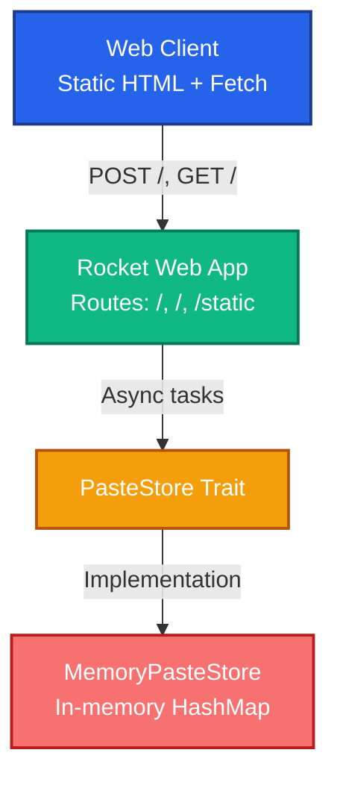

<div align="center">

# copypaste.fyi

Simple, open-source paste sharing for teams and individuals.

[](#run-with-docker-compose)
[](#run-locally)

</div>

## Overview

copypaste.fyi is a lightweight web service for creating and sharing plaintext snippets. It focuses on fast paste creation, predictable URLs, and minimal operational overhead. The UI is intentionally simple and responsive, making it easy to share links from any device.

Key traits:

- 🧠 **Zero complexity** – in-memory storage with minimal dependencies.
- ⚡ **Fast** – Rocket-based async backend with Tokio.
- 🐳 **Container friendly** – ready-to-run Docker image and compose service.
- 🔗 **Scriptable** – companion CLI (`cpaste`) for shell automation.

## Architecture



The flow is intentionally straightforward: the browser posts raw text to `/`, Rocket forwards the request to the `PasteStore` interface, and the in-memory backend issues a short identifier used for lookups.

- **Language:** Rust (edition 2021)
- **Framework:** Rocket 0.5
- **Async runtime:** Tokio 1.x
- **Storage:** Ephemeral in-memory hash map
- **CLI:** `cpaste` using `reqwest`

## Getting Started

### Prerequisites

- Rust toolchain (1.82+) installed via [rustup](https://rustup.rs/) – for local builds
- Docker (24+) and Docker Compose v2 – for containerized setup

### Run Locally

```bash
# Fetch dependencies and build
cargo build

# Start the web server
cargo run --bin copypaste

# Application available at http://127.0.0.1:8000/
```

Once running, open a browser to `http://127.0.0.1:8000/`, enter text, and hit **Create paste** to receive a link.

### Run with Docker Compose

```bash
docker compose up --build

# Visit http://127.0.0.1:8000/
```

Compose mounts the `static/` directory for live UI updates. Data is stored in-memory inside the container; restart clears pastes.

### CLI Usage (`cpaste`)

The CLI submits content to a running copypaste.fyi instance and prints the resulting link.

```bash
# From repository root
cargo run --bin cpaste -- "Hello from CLI"

# Or via stdin
echo "log output" | cargo run --bin cpaste --

# Target remote host
COPYPASTE_BASE_URL=https://copypaste.fyi cargo run --bin cpaste -- "notes"
```

## Project Structure

```
copypaste.fyi/
├── Cargo.toml          # Rust workspace and dependencies
├── Dockerfile          # Multi-stage build for production images
├── docker-compose.yml  # Local orchestration
├── src/
│   ├── lib.rs          # PasteStore trait + memory implementation
│   ├── main.rs         # Rocket application entry point
│   └── bin/
│       └── cpaste.rs   # CLI client
└── static/
    └── index.html      # Frontend interface
```

## Development Notes

- Pastes are kept in-process; production deployments should consider persistent storage.
- Use `cargo fmt` and `cargo clippy` before committing.
- The Docker image is built with Rust 1.82 slim base and serves the compiled binary on Debian bookworm.

## License

Licensed under the terms of the [MIT License](LICENSE).


