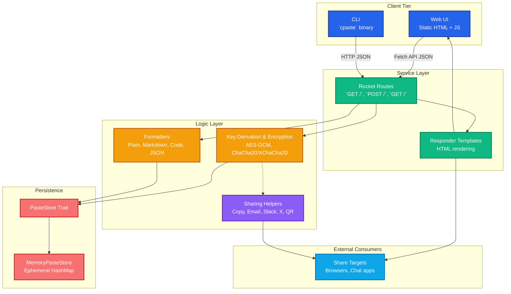

<div align="center">

# copypaste.fyi

Simple, open-source paste sharing for teams and individuals.

[](#run-with-docker-compose)
[](#run-locally)

</div>

## Overview

copypaste.fyi is a lightweight web service for creating and sharing plaintext snippets. It focuses on fast paste creation, predictable URLs, and minimal operational overhead. The UI is intentionally simple and responsive, making it easy to share links from any device.

Key traits:

- 🧠 **Zero complexity** – in-memory storage with minimal dependencies.
- ⚡ **Fast** – Rocket-based async backend with Tokio.
- 🐳 **Container friendly** – ready-to-run Docker image and compose service.
- 🔗 **Scriptable** – companion CLI (`cpaste`) for shell automation.

## Architecture



The flow stays minimal: the web UI (or CLI) posts JSON to `/`, Rocket validates retention/encryption choices, derives keys when needed, and persists the paste via the `PasteStore`. Renderers shape the viewing experience (markdown, code, JSON), while sharing helpers surface links to browsers, chat apps, and QR devices.

- **Language:** Rust (edition 2021)
- **Framework:** Rocket 0.5
- **Async runtime:** Tokio 1.x
- **Storage:** Ephemeral in-memory hash map
- **CLI:** `cpaste` using `reqwest`

## Getting Started

### Prerequisites

- Rust toolchain (1.82+) installed via [rustup](https://rustup.rs/) – for local builds
- Docker (24+) and Docker Compose v2 – for containerized setup

### Repository setup

Clone the repository, then install the tooling and git hooks used by CI:

```bash
# Install rustup toolchain, fmt/clippy, cargo-nextest, cargo-llvm-cov
./scripts/install_deps.sh

# Install the pre-commit hook (runs fmt, clippy, nextest on every commit)
./scripts/setup_git_hooks.sh
```

If the hook rewrites files (via `cargo fmt`) or a check fails, the commit is aborted so you can address the issue and re-stage. You can always run the steps manually with `cargo fmt --all`, `cargo clippy --all-targets --all-features -- -D warnings`, and `cargo nextest run --workspace --all-features`.

### Run Locally

```bash
# Fetch dependencies and build
cargo build

# Start the web server
cargo run --bin copypaste

# Application available at http://127.0.0.1:8000/
```

Once running, open a browser to `http://127.0.0.1:8000/`, enter text, and hit **Create paste** to receive a link.

**Formatting options**

- Plain text / Markdown / generic code block
- Language-specific code blocks: Go, C++, Kotlin, Java
- JSON pretty-print (parses and auto-indents or shows raw fallback)

**Encryption options**

- `None` – store plaintext (default)
- `AES-256-GCM` – deterministic 12-byte nonce per paste, client-supplied passphrase
- `ChaCha20-Poly1305` – compact 96-bit nonce cipher for performance-oriented clients
- `XChaCha20-Poly1305` – 24-byte nonce variant suited for longer keys and high-entropy secrets

The web UI includes multiple passphrase helpers (**Geek**, **Emoji combo**, **Diceware blend**) and a live key-strength meter. Keys stay visible (or toggle to hidden) so you can share them out-of-band—the server never stores them. A share panel provides easy copy, email, Slack, X/Twitter, QR, and native share shortcuts.

➡️ Dive deeper in the [Encryption guide](docs/encryption.md) for algorithm notes, key derivation details, and operational advice.

### Run with Docker Compose

```bash
docker compose up --build

# Visit http://127.0.0.1:8000/
```

Compose mounts the `static/` directory for live UI updates. Data is stored in-memory inside the container; restart clears pastes.

### CLI Usage (`cpaste`)

Build the standalone CLI and point it at any copypaste.fyi instance.

```bash
# Build the binary
cargo build --bin cpaste --release

# Send text directly (defaults to http://127.0.0.1:8000)
./target/release/cpaste -- "Hello from CLI"

# Switch hosts as needed
./target/release/cpaste --host https://copypaste.fyi -- "notes"

# Stream from stdin
echo "log output" | ./target/release/cpaste --stdin --host http://localhost:8000 --
```

**Flags & arguments**

| Option | Description |
| ------ | ----------- |
| `--host <URL>` | Base URL of the copypaste server. Defaults to `http://127.0.0.1:8000`. |
| `--stdin` | Read the paste content from standard input instead of the command line argument. |
| `--format <plain_text|markdown|code|json|go|cpp|kotlin|java>` | Rendering mode for the paste. Defaults to `plain_text`. |
| `--encryption <none|aes256_gcm|chacha20_poly1305|xchacha20_poly1305>` | Client-side encryption algorithm. When not `none`, pass `--key`. |
| `--key <string>` | Encryption key / passphrase (required for encrypted pastes). |
| positional text | When `--stdin` is not provided, supply the text to paste as a positional argument. |

`cpaste --help` displays the full command reference.

### Packaging CLI for Releases

The repository includes a helper to bundle the CLI binary for GitHub releases.

```
# Build and package version 0.2.0 under dist/
./scripts/package_cli.sh 0.2.0

# Artifacts created:
# - dist/cpaste-0.2.0.tar.gz
# - dist/cpaste-0.2.0.tar.gz.sha256

# Suggested workflow:
# 1. git tag -a v0.2.0 -m "Release v0.2.0"
# 2. git push origin v0.2.0
# 3. Draft a GitHub release and upload the tarball + checksum
```

A GitHub Actions workflow (`.github/workflows/release.yml`) automates steps 2–4 whenever a tag matching `v*` is pushed: it runs the packaging script and publishes the generated artifacts as release assets.

## Project Structure

```
copypaste.fyi/
├── Cargo.toml          # Rust workspace and dependencies
├── Dockerfile          # Multi-stage build for production images
├── docker-compose.yml  # Local orchestration
├── src/
│   ├── lib.rs          # PasteStore trait + memory implementation
│   ├── main.rs         # Rocket application entry point
│   └── bin/
│       └── cpaste.rs   # CLI client
└── static/
    └── index.html      # Frontend interface
```

## Development Notes

- Pastes are kept in-process; production deployments should consider persistent storage.
- Use `cargo fmt` and `cargo clippy` before committing.
- The Docker image is built with Rust 1.82 slim base and serves the compiled binary on Debian bookworm.

## Contributing

Pull requests are welcome! Please:

1. Install the tooling and git hooks described in [Repository setup](#repository-setup).
2. Ensure formatting, linting, and tests pass locally: `cargo fmt --all`, `cargo clippy --all-targets --all-features -- -D warnings`, and `cargo nextest run --workspace --all-features`.
3. (Optional but encouraged) Verify coverage meets CI expectations: `cargo llvm-cov --workspace --all-features --nextest --fail-under-lines 75`.
4. Keep changes focused and add tests when extending functionality.

## License

Licensed under the terms of the [MIT License](LICENSE).


