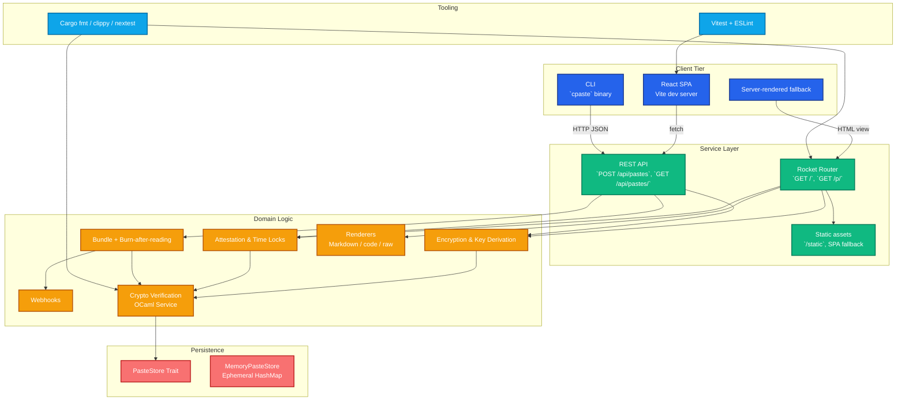

<div align="center">

# copypaste.fyi

Lightweight, open-source paste sharing with **client-side encryption**, burn-after-reading links,
post-quantum cryptography, and **dual cryptographic verification** (Rust + independent OCaml service).

[](https://github.com/qxlsz/copypaste.fyi/actions/workflows/ci.yml)
[](#)
[](#deploy)
[](https://crates.io/crates/copypaste)
[](LICENSE)
[](#run-locally)

</div>

## 60-second start

```bash
docker compose up --build   # backend :8000  +  crypto verifier :8001
```

Open <http://127.0.0.1:8000>, paste text, click **Create paste**. Done.
For CLI or source builds see [Getting Started](#getting-started).

## Overview

copypaste.fyi is a lightweight web service for creating and sharing plaintext snippets. It focuses on fast paste creation, predictable URLs, and minimal operational overhead. The UI is intentionally simple and responsive, making it easy to share links from any device.

## Why copypaste.fyi?

Unlike [PrivateBin](https://privatebin.info/) (PHP, requires server-side config) or
[microbin](https://github.com/szabodanika/microbin) (no CLI), copypaste.fyi is built for
operators who want a single binary with no database and for users who want verifiable client-side
encryption.

| Feature | copypaste.fyi | PrivateBin | microbin | rustypaste |
|---|:---:|:---:|:---:|:---:|
| Rust backend | ✅ | ❌ PHP | ✅ | ✅ |
| No database required | ✅ | ❌ | ❌ SQLite | ✅ filesystem |
| Post-quantum crypto | ✅ | ❌ | ❌ | ❌ |
| Dual crypto verification | ✅ | ❌ | ❌ | ❌ |
| CLI client | ✅ `cpaste` | ❌ | ❌ | ✅ |
| Steganography | ✅ | ❌ | ❌ | ❌ |
| Burn-after-reading | ✅ | ✅ | ✅ | ✅ |

Key traits:

- 🔐 **Client-side encryption** – AES-256-GCM, ChaCha20-Poly1305, XChaCha20-Poly1305, Kyber hybrid (post-quantum). Keys never touch the server.
- 🔬 **Dual crypto verification** – every encrypt/decrypt operation is independently confirmed by a secondary OCaml service (`mirage-crypto`) for defense-in-depth assurance.
- 🧨 **Burn-after-reading** – optional one-time links that self-destruct on first view.
- 🛡️ **Privacy journey tracker** – real-time indicator showing HTTPS, Tor, VPN, DNT, and encryption status.
- 🔗 **Scriptable** – companion CLI (`cpaste`) and JSON REST API for shell automation.
- 🐳 **Container-first** – single `docker compose up --build` brings up backend + crypto verifier.
- ⚡ **Fast** – async Rocket (Rust) backend; no database required by default.

## Architecture


```mermaid
graph TD
    classDef client fill:#2563eb,stroke:#1e3a8a,color:#fff;
    classDef service fill:#10b981,stroke:#047857,color:#fff;
    classDef logic fill:#f59e0b,stroke:#b45309,color:#fff;
    classDef storage fill:#f87171,stroke:#b91c1c,color:#fff;
    classDef util fill:#8b5cf6,stroke:#5b21b6,color:#fff;
    classDef tooling fill:#0ea5e9,stroke:#0369a1,color:#fff;
    classDef link stroke-width:2px;

    subgraph Client Tier
        A[React SPA\nVite dev server]
        B[CLI\n`cpaste` binary]
        C[Server-rendered fallback]
    end

    subgraph Service Layer
        D[Rocket Router\n`GET /`, `GET /p/<id>`]
        E[REST API\n`POST /api/pastes`, `GET /api/pastes/<id>`]
        F[Static assets\n`/static`, SPA fallback]
    end

    subgraph Domain Logic
        G[Encryption & Key Derivation]
        H[Attestation & Time Locks]
        I[Bundle + Burn-after-reading]
        J[Renderers\nMarkdown / code / raw]
        K[Webhooks]
        L[Crypto Verification\nOCaml Service]
    end

    subgraph Persistence
        N[PasteStore Trait]
        O[MemoryPasteStore\nEphemeral HashMap]
    end

    subgraph Tooling
        P[Vitest + ESLint]
        Q[Cargo fmt / clippy / nextest]
    end

    A -->|fetch| E
    B -->|HTTP JSON| E
    C -->|HTML view| D
    D --> F
    D --> G
    D --> H
    E --> G
    E --> H
    G --> L
    H --> L
    I --> L
    L --> N
    D --> J
    E --> I
    I --> K
    P --> A
    Q --> D
    Q --> L

    class A,B,C client;
    class D,E,F service;
    class G,H,I,J,K,L logic;
    class N,O storage;
    class P,Q tooling;
    class A,B,C,D,E,F,G,H,I,J,K,L,N,O,P,Q link;
```

The SPA communicates with the Rocket REST API for creation and viewing, while the server still renders HTML for raw links and one-time fallbacks. Domain helpers handle encryption, attestations, bundles, and webhook notifications before persisting to the in-memory store.

- **Backend:** Rust (edition 2021), Rocket 0.5, Tokio 1.x
- **Cryptographic Verification:** OCaml service with `mirage-crypto` for independent security validation
- **Frontend:** React 19 + Vite 7, TanStack Query, Tailwind CSS
- **Storage:** Ephemeral in-memory `PasteStore`
- **CLI:** `copypaste send` using `reqwest`
- **Tooling:** Cargo fmt/clippy/nextest, Vitest, ESLint

## Near-term roadmap

- [ ] Persistent storage option (SQLite adapter behind the `PasteStore` trait) so pastes survive restarts without Redis
- [ ] Rate limiting middleware (leaky-bucket per IP) to harden public deployments
- [ ] Real Kyber-1024 KEM via `pqcrypto` crate (current implementation uses SHA-256 as KEM simulation)
- [x] `SECURITY.md` and CVE reporting process
- [x] Post-quantum Kyber hybrid encryption
- [x] OCaml dual cryptographic verification
- [x] Burn-after-reading
- [x] Fly.io process-group deployment

Contributions welcome — pick any unchecked item and open a PR.

## Getting Started

### Prerequisites

- Rust toolchain (1.82+) installed via [rustup](https://rustup.rs/) – for local builds
- Docker (24+) and Docker Compose v2 – for containerized setup

### Via cargo (all platforms)

```bash
cargo install copypaste
copypaste serve &
echo "hello world" | copypaste send --stdin
```

### Via Homebrew (macOS/Linux)

```bash
brew install qxlsz/tap/copypaste
```

### Via install script (Linux/macOS)

```bash
curl -sSf https://raw.githubusercontent.com/qxlsz/copypaste.fyi/main/scripts/install.sh | sh
```

### Repository setup

Clone the repository, then install the tooling and git hooks used by CI:

```bash
# Install rustup toolchain, fmt/clippy, cargo-nextest, cargo-llvm-cov
./scripts/install_deps.sh

# Install the pre-commit hook (runs fmt, clippy, nextest on every commit)
./scripts/setup_git_hooks.sh
```

If the hook rewrites files (via `cargo fmt`) or a check fails, the commit is aborted so you can address the issue and re-stage. You can always run the steps manually with `cargo fmt --all`, `cargo clippy --all-targets --all-features -- -D warnings`, and `cargo nextest run --workspace --all-features`.

### Run Locally

```bash
# Fetch dependencies and build
cargo build

# Start the web server
cargo run --bin copypaste

# Application available at http://127.0.0.1:8000/
```

Once running, open a browser to `http://127.0.0.1:8000/`, enter text, and hit **Create paste** to receive a link. The backend serves the pre-built SPA from `static/dist` when the Vite dev server is not running.

### Frontend development

```bash
cd frontend
npm install               # run once; scripts/precommit.sh handles this too
npm run dev               # Vite dev server at http://127.0.0.1:5173/

# Lint + unit tests (Vitest)
npm run lint
npm test -- --run

# Build production assets (writes to static/dist)
npm run build
```

For an all-in-one local environment (Rocket API + Vite dev server) run `./scripts/run_both.sh`. The script automatically configures the frontend to communicate with the backend API, ensuring proper functionality for features like Kyber encryption. Stop everything with `./scripts/stop.sh`.

## Deploy

### Docker Compose (recommended)

```bash
docker compose up --build
```

Starts the Rust backend on `:8000` and the OCaml crypto verifier on `:8001`. Data is in-memory; restart clears pastes. Persistent storage via Redis:

```bash
COPYPASTE_REDIS_URL=redis://redis:6379 docker compose up --build
```

### Fly.io

```bash
fly launch   # first time; creates fly.toml
fly deploy
fly logs
```

The included `fly.toml` uses Fly.io process groups: the `app` process runs the Rocket backend and `crypto-verifier` runs the OCaml service on the same machine.

### Bare metal / VPS

```bash
cargo build --release
./target/release/copypaste          # listens on 0.0.0.0:8000

# Optional: point at a running OCaml verifier
CRYPTO_VERIFIER_URL=http://127.0.0.1:8001 ./target/release/copypaste
```

Reverse-proxy with nginx or Caddy; TLS termination is strongly recommended for public instances.

### Environment variables

| Variable | Default | Description |
|---|---|---|
| `ROCKET_ADDRESS` | `0.0.0.0` | Bind address |
| `ROCKET_PORT` | `8000` | Bind port |
| `CRYPTO_VERIFIER_URL` | `http://localhost:8001` | OCaml verifier endpoint |
| `COPYPASTE_REDIS_URL` | _(none)_ | Enable Redis persistence |
| `COPYPASTE_REDIS_KEY_PREFIX` | `paste:` | Redis key namespace |
| `COPYPASTE_ONION_HOST` | _(none)_ | Tor `.onion` hostname |
| `RUST_LOG` | `info` | Log verbosity |

### Clipboard integration (bash/zsh)

Add this function to `~/.bashrc` or `~/.zshrc` to pipe anything from your clipboard straight to a running instance:

```bash
cpaste-clip() {
  local host="${CPASTE_HOST:-http://127.0.0.1:8000}"
  pbpaste 2>/dev/null || xclip -o 2>/dev/null || wl-paste 2>/dev/null \
    | curl -s -X POST "$host/api/pastes" \
        -H 'Content-Type: application/json' \
        --data-raw "{\"content\": $(cat - | python3 -c 'import sys,json; print(json.dumps(sys.stdin.read()))'), \"format\": \"plain_text\"}" \
    | python3 -c 'import sys,json; d=json.load(sys.stdin); print("'"$host"'" + d["shareableUrl"])'
}
```

Usage: `cpaste-clip` — prints the paste URL. Override host with `CPASTE_HOST=https://copypaste.fyi cpaste-clip`.

## REST API

Interact with copypaste.fyi programmatically through the JSON API. All endpoints live under `/api` and accept/return UTF-8 JSON.

### Create a paste

`POST /api/pastes`

```bash
curl -X POST http://127.0.0.1:8000/api/pastes \
  -H 'Content-Type: application/json' \
  -d '{
        "content": "Hello from the API",
        "format": "plain_text",
        "retention_minutes": 60,
        "burn_after_reading": false,
        "encryption": {
          "algorithm": "aes256_gcm",
          "key": "correct-horse-battery-staple"
        }
      }'
```

**Request body**

| Field | Type | Required | Description |
| --- | --- | --- | --- |
| `content` | `string` | ✅ | Paste body. |
| `format` | `string` | ❌ | One of `plain_text`, `markdown`, `code`, `json`, `go`, `cpp`, `kotlin`, `java`. Defaults to `plain_text`. |
| `retention_minutes` | `number` | ❌ | Minutes before automatic deletion. Omit for no expiry. |
| `burn_after_reading` | `boolean` | ❌ | Delete paste after first successful view. |
| `encryption.algorithm` | `string` | ❌ | `aes256_gcm`, `chacha20_poly1305`, `xchacha20_poly1305`, or `kyber_hybrid_aes256_gcm`. |
| `encryption.key` | `string` | ⚠️ | Required when `encryption.algorithm` is provided. Never stored server-side. |

**Response**

```jsonc
{
  "id": "AbCdEf12",
  "shareableUrl": "/p/AbCdEf12",
  "burnAfterReading": false
}
```

The `shareableUrl` is relative to the server origin. For encrypted pastes, append `?key=<secret>` to the share link before sharing.

### Fetch a paste

`GET /api/pastes/{id}`

```bash
curl http://127.0.0.1:8000/api/pastes/AbCdEf12

# Encrypted paste
curl "http://127.0.0.1:8000/api/pastes/AbCdEf12?key=correct-horse-battery-staple"
```

**Response**

```jsonc
{
  "id": "AbCdEf12",
  "content": "Hello from the API",
  "format": "plain_text",
  "createdAt": 1730518840,
  "expiresAt": null,
  "burnAfterReading": false,
  "encryption": {
    "requiresKey": true,
    "algorithm": "aes256_gcm"
  },
  "timeLock": null,
  "persistence": {
    "kind": "memory"
  }
}
```

A `401 Unauthorized` response indicates a missing or invalid key for an encrypted paste. A `404` means the paste never existed or was already burned/time-locked.

### Raw paste view

`GET /p/{id}/raw`

Returns plain text (no JSON envelope) for shell-friendly consumption.

```bash
curl http://127.0.0.1:8000/p/AbCdEf12/raw
```

Encrypted pastes require the key query parameter: `/p/{id}/raw?key=<secret>`.

> 💡 Looking for CLI automation? See [CLI Usage (`copypaste send`)](#cli-usage-copypaste-send) for examples that wrap these endpoints.

### Formatting options

- Plain text / Markdown / generic code block
- Language-specific code blocks: Go, C++, Kotlin, Java
- JSON pretty-print (parses and auto-indents or shows raw fallback)

**Encryption options**

- `None` – store plaintext (default)
- `AES-256-GCM` – deterministic 12-byte nonce per paste, client-supplied passphrase
- `ChaCha20-Poly1305` – compact 96-bit nonce cipher for performance-oriented clients
- `XChaCha20-Poly1305` – 24-byte nonce variant suited for longer keys and high-entropy secrets
- `Kyber Hybrid AES-256-GCM` – post-quantum key exchange with classical symmetric encryption

**Security Features**

- **Dual Cryptographic Verification**: Each encryption operation is independently verified by both the primary Rust implementation and a secondary OCaml service using `mirage-crypto` library for defense-in-depth security assurance.
- **Client-Side Encryption**: Keys are never stored server-side and encryption happens in memory before transmission.
- **Zero-Trust Architecture**: Encrypted pastes require explicit key sharing out-of-band.
- **Post-Quantum Ready**: Kyber hybrid encryption provides quantum-resistant key exchange with AES-256-GCM symmetric encryption.
- **Privacy Journey Tracker**: Real-time visualization of privacy measures protecting your connection (HTTPS/TLS, Tor network, VPN/proxy detection, Do Not Track, private browsing mode, and client-side encryption status).

### Privacy Journey

The **Privacy Journey** indicator appears in the bottom-left corner of the web interface, showing a real-time privacy score based on detected security measures:

- 🔒 **Encrypted Connection** - HTTPS/TLS active
- 🌐 **Tor Network** - Accessing via .onion service
- 🛡️ **VPN/Proxy** - Heuristic detection of privacy proxies
- 👁️ **Do Not Track** - Browser DNT header enabled
- ⚡ **Private Browsing** - Incognito/private mode detection
- 🖥️ **Client-Side Encryption** - Keys never leave your device

Inspired by [how-did-i-get-here.net](https://how-did-i-get-here.net/), this feature educates users about the privacy layers safeguarding their data without being intrusive. Click the indicator to see detailed information about each detected measure.

### Kyber Hybrid Encryption

copypaste.fyi implements **Kyber hybrid encryption** - a post-quantum key encapsulation mechanism (KEM) combined with classical symmetric encryption for optimal security and performance.

**How it works:**
1. **PQ Key Generation**: Creates Kyber public/private key pair (simulated in current implementation)
2. **Key Encapsulation**: Derives shared secret from private key + nonce entropy
3. **Symmetric Encryption**: Uses SHA256(shared_secret + user_key) to derive AES-256-GCM key
4. **Storage Format**: Combines PQ components with encrypted payload: `PQ_ciphertext|PQ_public_key|aes_ciphertext|aes_nonce|PQ_private_key`

**Benefits:**
- **Quantum Resistance**: Kyber KEM protects against quantum attacks on key exchange
- **Performance**: AES-256-GCM provides fast symmetric encryption for large data
- **Future-Proof**: Easy migration path to real Kyber implementation
- **Compatibility**: Works alongside existing AES/ChaCha algorithms

**Current Status**: Hybrid simulation using SHA256 for KEM operations. Ready for production use with fallback to real Kyber implementation.

The web UI includes multiple passphrase helpers (**Geek**, **Emoji combo**, **Diceware blend**) and a live key-strength meter. Keys stay visible (or toggle to hidden) so you can share them out-of-band—the server never stores them. A share panel provides easy copy, email, Slack, X/Twitter, QR, and native share shortcuts.

**Extras**

- Burn after reading: toggle in the composer (or pass `--burn-after-reading` via CLI) to delete the paste after the first successful view.
- Raw view: append `/raw/<id>` (plus `?key=<passphrase>` when encrypted) to retrieve plaintext without HTML chrome.

➡️ Dive deeper in the [Encryption guide](docs/encryption.md) for algorithm notes, key derivation details, and operational advice.

### CLI Usage (`copypaste send`)

Build the binary and point it at any copypaste.fyi instance.

```bash
# Build the binary
cargo build --bin copypaste --release

# Send text directly (defaults to http://127.0.0.1:8000)
./target/release/copypaste send "Hello from CLI"

# Switch hosts as needed
./target/release/copypaste send --host https://copypaste.fyi "notes"

# Stream from stdin
echo "log output" | ./target/release/copypaste send --stdin
```

**Flags & arguments**

| Option | Description |
| ------ | ----------- |
| `--host <URL>` | Base URL of the copypaste server. Defaults to `http://127.0.0.1:8000`. |
| `--stdin` | Read the paste content from standard input instead of the command line argument. |
| `--format <plain_text|markdown|code|json|go|cpp|kotlin|java>` | Rendering mode for the paste. Defaults to `plain_text`. |
| `--encryption <none|aes256_gcm|chacha20_poly1305|xchacha20_poly1305|kyber_hybrid_aes256_gcm>` | Client-side encryption algorithm. When not `none`, pass `--key`. |
| `--key <string>` | Encryption key / passphrase (required for encrypted pastes). |
| `--burn-after-reading` | Delete the paste immediately after the first successful view (one-time link). |
| positional text | When `--stdin` is not provided, supply the text to paste as a positional argument. |

`copypaste send --help` displays the full command reference.

### Shell function (`~/.bashrc` / `~/.zshrc`)

Drop this into your shell profile to pipe any content to a running instance:

```bash
function paste() {
  jq -Rs '{"content": .}' | \
    curl -s -XPOST https://your-instance/api/pastes \
      -H 'Content-Type: application/json' --data @- | jq -r '.shareableUrl'
}
# Usage: cat file.txt | paste
#        echo "note" | paste
```

`jq -Rs` reads stdin as a raw string and builds the JSON payload safely, preventing corruption from quotes, backslashes, or `$` in the pasted content.

### Packaging CLI for Releases

The repository includes a helper to bundle the CLI binary for GitHub releases.

```
# Build and package version 0.2.0 under dist/
./scripts/package_cli.sh 0.2.0

# Artifacts created:
# - dist/copypaste-0.2.0.tar.gz
# - dist/copypaste-0.2.0.tar.gz.sha256

# Suggested workflow:
# 1. git tag -a v0.2.0 -m "Release v0.2.0"
# 2. git push origin v0.2.0
# 3. Draft a GitHub release and upload the tarball + checksum
```

A GitHub Actions workflow (`.github/workflows/release.yml`) automates steps 2–4 whenever a tag matching `v*` is pushed: it runs the packaging script and publishes the generated artifacts as release assets.

## Project Structure

```
copypaste.fyi/
├── Cargo.toml          # Rust workspace and dependencies
├── Dockerfile.backend  # Multi-stage build for production (Rust + OCaml)
├── docker-compose.yml  # Local orchestration
├── fly.toml           # Fly.io deployment configuration
├── ocaml-crypto-verifier/    # OCaml cryptographic verification service
│   ├── dune-project
│   ├── lib/
│   │   └── crypto_verifier.ml
│   ├── bin/
│   │   └── server.ml
│   ├── test/
│   └── Dockerfile
├── src/
│   ├── lib.rs          # PasteStore trait + memory implementation
│   └── bin/
│       └── copypaste.rs  # Unified binary: serve, send, config
├── static/
│   └── index.html      # Frontend interface
└── .github/workflows/  # CI/CD pipelines
```

## Development Notes

- Pastes are kept in-process; production deployments should consider persistent storage.
- Use `cargo fmt` and `cargo clippy` before committing.
- The Docker image is built with Rust 1.82 slim base and serves the compiled binary on Debian bookworm.
- Async code steers clear of the futurelock pattern described in [RFD 609](https://rfd.shared.oxide.computer/rfd/0609); when adding concurrent flows, prefer spawning owned futures or a `JoinSet` instead of holding borrowed futures across `await` points.

## Contributing

Pull requests are welcome! Please:

1. Install the tooling and git hooks described in [Repository setup](#repository-setup).
2. Ensure formatting, linting, and tests pass locally: `cargo fmt --all`, `cargo clippy --all-targets --all-features -- -D warnings`, and `cargo nextest run --workspace --all-features`.
3. (Optional but encouraged) Verify coverage meets CI expectations: `cargo llvm-cov --workspace --all-features --nextest --fail-under-lines 75`.
4. Keep changes focused and add tests when extending functionality.

## About

Visit `/about.txt` for a plain text overview of the service and its security features.

## License

Licensed under the terms of the [Apache License 2.0](LICENSE).


