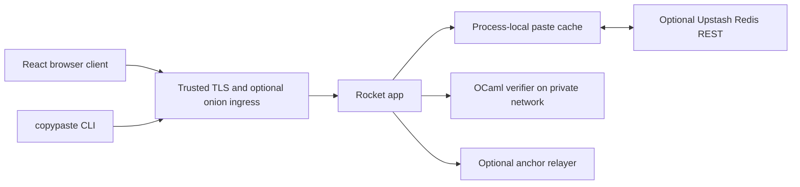

<div align="center">

# copypaste.fyi

Lightweight paste sharing with authenticated server-side encryption, controlled write admission,
targeted moderation, and optional independent cryptographic verification.

[](https://github.com/qxlsz/copypaste.fyi/actions/workflows/ci.yml)
[](#)
[](#run-with-docker-compose)
[](https://crates.io/crates/copypaste)
[](LICENSE)
[](#run-from-source)

</div>

## Security boundary

copypaste.fyi encrypts selected pastes in the Rust service. Clients must use TLS to a trusted edge,
but plaintext and the supplied key can also traverse the edge-to-Rocket hop and exist in service
memory while the app encrypts or decrypts the paste. The key is not intentionally persisted, but
this is not browser-only, end-to-end, or zero-knowledge encryption. Encrypt locally before upload
if every component in that path must not see plaintext.

For AES-256-GCM and ChaCha20-Poly1305 creation, the Rust service also sends the plaintext, supplied
key, ciphertext, nonce, and salt to the OCaml verifier. On Fly, that request uses application-layer
HTTP over the private network to a separate VM. Treat the verifier VM and that private transport as
part of the trusted plaintext boundary.

The hardened build also has these deliberate limits:

- Public Fly deployments require a service admission credential. Current clients put it in
  `X-CopyPaste-Write-Token`. A signed login session in `Authorization` may provide user identity,
  but it is not write admission on the supplied Fly configuration.
- Bundles, attestations, webhooks, and steganography are disabled. Requests for them are rejected,
  and setting their former allow flags to `true` stops startup.
- Burn-after-reading is best-effort. It is not an exactly-once, cross-instance redemption protocol.
- Sessions, user/workspace listings, statistics, and the Redis read cache are process-local. Run one
  `app` instance until these indexes and mutation controls use shared state.

Read [Security policy](SECURITY.md) before exposing an instance to the internet. Operators should
also prepare the [abuse-response runbook](docs/abuse-response.md) before accepting writes.

## Quick start

Run the backend and its OCaml verifier locally:

```bash
docker compose up --build
```

Then open <http://127.0.0.1:8000>. The Compose port mapping publishes port 8000 on the host's
interfaces and permits anonymous writes by default. Use it only on an isolated development host or
behind a firewall; do not copy that setting to a public deployment.

## Features

- Server-side authenticated encryption with AES-256-GCM, ChaCha20-Poly1305,
  XChaCha20-Poly1305, and an experimental ML-KEM-768 plus AES-256-GCM envelope
- Optional strict OCaml verification for AES-256-GCM and ChaCha20-Poly1305 creation
- Cryptographically random 24-character paste IDs
- Time locks, retention limits, and best-effort burn-after-reading
- Exact-ID quarantine and metadata-only administrator moderation
- Optional Upstash Redis REST persistence
- Tor-only pastes behind a trusted ingress contract
- Administrator-only, content-safe manifest anchoring
- React web application, JSON API, raw route, and a secret-file-aware CLI

## Architecture


```mermaid
flowchart LR
    browser[React browser client]
    cli[copypaste CLI]
    edge[Trusted TLS and optional onion ingress]
    app[Rocket app]
    cache[Process-local paste cache]
    redis[Optional Upstash Redis REST]
    verifier[OCaml verifier on private network]
    relayer[Optional anchor relayer]

    browser --> edge
    cli --> edge
    edge --> app
    app --> cache
    cache <--> redis
    app --> verifier
    app --> relayer
```

The in-memory store remains the application cache even when Redis persistence is enabled. Creates,
updates, and finalization are persisted before success is acknowledged. A persistence failure is
reported instead of silently falling back to memory. Per-ID mutation ordering is local to one app
process; there is no distributed compare-and-swap or tombstone across app instances.

Fly process groups do not share a machine. The supplied configuration runs `app` and
`crypto-verifier` on separate VMs and connects them over Fly private DNS.

## Install

### Cargo

```bash
cargo install copypaste
ROCKET_ADDRESS=127.0.0.1 copypaste serve
```

### Homebrew

```bash
brew install qxlsz/tap/copypaste
```

## Run from source

Install Rust 1.88 or newer, Node.js 20, and the repository tools, then run:

```bash
./scripts/install_deps.sh
./scripts/setup_git_hooks.sh
ROCKET_ADDRESS=127.0.0.1 cargo run --bin copypaste -- serve
```

The explicit address above limits this local example to loopback. The configuration default is
`0.0.0.0`, so set `ROCKET_ADDRESS` deliberately before running the server outside a container.

For frontend development:

```bash
cd frontend
npm install
npm run dev
```

The Vite server listens on <http://127.0.0.1:5173> and proxies API requests to the backend. Run
`ROCKET_ADDRESS=127.0.0.1 ./scripts/run_both.sh` to start both development processes and
`./scripts/stop.sh` to stop them.

## Run with Docker Compose

```bash
docker compose up --build
```

The backend port mapping listens on the host's interfaces at port 8000. Compose and the published
image probe `GET /api/health` through `copypaste healthcheck` so Docker can mark an unresponsive
process unhealthy without a shell (the runtime image is distroless). The verifier is reachable
only on its internal Docker network. Paste storage defaults to memory; the `/data` volume is for the
SQLite API-key database, not paste content.

To persist pastes through the supported Upstash REST adapter, supply all three values through your
environment or secret manager:

```text
COPYPASTE_PERSISTENCE_BACKEND=redis
UPSTASH_REDIS_REST_URL=https://your-database.upstash.io
UPSTASH_REDIS_REST_TOKEN=your-provider-token
```

The adapter accepts an optional `COPYPASTE_REDIS_KEY_PREFIX` (default `paste:`), uses Redis TTLs for
expiring records, and sends commands and serialized records in HTTPS JSON request bodies. It does
not speak the native Redis protocol. Missing or invalid explicit Redis configuration stops startup.

## Deploy to Fly.io

Before the first deploy, store these values in an approved secret manager and import them into Fly:

- `COPYPASTE_AUTH_TOKEN`: service write-admission token
- `COPYPASTE_ADMIN_TOKEN`: retained bootstrap administrator token
- `UPSTASH_REDIS_REST_URL`: clean Upstash HTTPS origin
- `UPSTASH_REDIS_REST_TOKEN`: Upstash REST token

Generate each static application token from at least 256 bits of randomness and encode it as 43 to
128 base64url characters (`A-Z`, `a-z`, `0-9`, `_`, and `-`). A non-empty static token outside that
format stops production startup.

The checked-in `fly.toml` requires write authentication, Redis persistence, and strict verifier
checks for supported algorithms. A missing persistence secret causes startup to fail. The `app` and
`crypto-verifier` process groups run on separate VMs.

```bash
fly deploy
fly logs
```

The current Fly configuration does not set `COPYPASTE_SQLITE_PATH`. Dynamic API-key creation,
listing, and revocation therefore return `503`; use the retained static admin token. To enable
dynamic keys, configure an owner-controlled SQLite path. On Unix, its existing parent directory
must belong to the service user and have mode `0700`; the database is created with mode `0600`. On
other platforms, apply equivalent owner-only ACLs because startup does not verify Unix ownership or
mode bits. On Fly, the path also needs durable storage tied to the single app instance.

Do not scale the `app` process beyond one instance yet. The verifier remains a separate process
group and does not affect this restriction.

## Configure Tor ingress

Tor-only access requires this exact pair:

```text
COPYPASTE_ONION_HOST=your-service-address.onion
COPYPASTE_ONION_INGRESS_TOKEN=a-random-visible-ascii-secret-of-at-least-32-bytes
```

Startup fails if only one value is set, if the host is not accepted as a syntactically `.onion`
hostname, or if the token is outside the accepted 32 to 512 visible-ASCII byte range. Independently
verify that the configured value is the intended Tor v3 service address before deployment.

The reverse proxy is part of the security boundary. Configure it to:

1. Remove every client-supplied `X-Copypaste-Onion-Ingress` header on every ingress.
2. Preserve or overwrite `Host` with the exact configured onion hostname on the onion listener.
3. Inject `X-Copypaste-Onion-Ingress` with the configured secret only on that listener.
4. Never inject the header on the public listener.

The application requires both the exact onion `Host` and a constant-time token match. `Host` alone
does not prove Tor ingress, and `X-Forwarded-Host` is never trusted for this decision.

## Main environment variables

| Variable | Default | Purpose |
|---|---|---|
| `ROCKET_ADDRESS` | `0.0.0.0` | Backend bind address |
| `ROCKET_PORT` | `8000` | Backend port |
| `COPYPASTE_AUTH_TOKEN` | unset | Static service admission token; 43–128 base64url characters in production |
| `COPYPASTE_ADMIN_TOKEN` | unset | Static admin token; 43–128 base64url characters in production |
| `COPYPASTE_REQUIRE_WRITE_AUTH` | `false` | Reject writes without service admission; `true` in `fly.toml` |
| `COPYPASTE_ALLOW_SESSION_WRITES` | `false` | Compatibility policy; keep `false` on closed deployments |
| `COPYPASTE_SQLITE_PATH` | unset | Secure file for dynamic API-key hashes; unset disables dynamic key management |
| `COPYPASTE_PERSISTENCE_BACKEND` | `memory` | Supported values: `memory` or `redis` |
| `UPSTASH_REDIS_REST_URL` | unset | Upstash REST origin required by the Redis backend |
| `UPSTASH_REDIS_REST_TOKEN` | unset | Upstash REST bearer token required by the Redis backend |
| `COPYPASTE_REDIS_KEY_PREFIX` | `paste:` | Upstash key namespace |
| `COPYPASTE_BLOCKED_PASTE_IDS` | unset | Complete comma-separated quarantine set; invalid IDs stop startup |
| `COPYPASTE_MAX_PASTE_SIZE` | `1048576` | Maximum request content bytes, capped at 1 MiB |
| `COPYPASTE_RATE_LIMIT_CREATES` | config default | Per-process create and mutation limit |
| `COPYPASTE_RATE_LIMIT_READS` | config default | Per-process read limit |
| `COPYPASTE_ALLOWED_ORIGINS` | deployment-specific | Exact browser CORS allowlist |
| `COPYPASTE_TRUSTED_IP_HEADER` | unset | Client-IP header trusted only when the edge overwrites it |
| `CRYPTO_VERIFIER_URL` | `http://localhost:8001` | Clean verifier origin; private HTTP or HTTPS only |
| `COPYPASTE_REQUIRE_CRYPTO_VERIFICATION` | `false` | Fail supported encryption creation when verification fails; `true` in bundled deployments |
| `COPYPASTE_ONION_HOST` | unset | Exact onion hostname; must be paired with the ingress token |
| `COPYPASTE_ONION_INGRESS_TOKEN` | unset | Secret injected only by the trusted onion ingress |
| `ANCHOR_RELAY_ENDPOINT` | unset | HTTPS anchor relayer endpoint; HTTP is loopback-only |

All former feature-enabling `COPYPASTE_ALLOW_*` flags for webhooks, attestations, and steganography
must remain unset or `false`. Enabling them is unsupported and stops startup. Bundles are also
disabled and have no enable flag in the hardened build.

## Write authentication

On a closed deployment, `POST /api/pastes` and `POST /` require a static write token, the static
admin token, or a dynamic write/admin API key. Current clients send that credential in:

```http
X-CopyPaste-Write-Token: service-admission-credential
```

`Authorization: Bearer <session-token>` is optional on creation and supplies authenticated user
identity for ownership and user/workspace listings. Keep identity separate from service admission.
For live-paste update and finalization, `Authorization` carries the paste ownership token while
`X-CopyPaste-Write-Token` still carries service admission.

The create guard retains a compatibility fallback for legacy clients that put only the service
credential in `Authorization`. Do not use that fallback in new integrations; it cannot carry user
identity at the same time. Live mutations do not have this fallback.

Dynamic API keys are available only when `COPYPASTE_SQLITE_PATH` opens safely. An invalid explicit
path stops startup rather than falling back. Static tokens are loaded once when the app starts and
must be rotated through the deployment secret manager. In production, each configured static token
must contain 43 to 128 base64url characters; malformed non-empty values stop startup.

## API

The primary routes are:

| Method | Route | Purpose |
|---|---|---|
| `POST` | `/api/pastes` | Create a paste |
| `GET` | `/api/pastes/{id}` | Fetch JSON; prefer `X-Paste-Key` for encrypted pastes |
| `GET` | `/p/{id}` | Shareable HTML route returned by creation |
| `GET` | `/raw/{id}` | Raw text route |
| `PUT` | `/api/pastes/{id}` | Update a live paste |
| `PATCH` | `/api/pastes/{id}/finalize` | Finalize a live paste |
| `POST` | `/api/pastes/{id}/anchor` | Admin-only manifest anchoring |
| `GET` | `/api/admin/pastes/{id}` | Admin-only metadata triage |
| `DELETE` | `/api/admin/pastes/{id}` | Admin-only exact-ID deletion |
| `GET` | `/health`, `/api/health` | Public liveness only |

`/health` and `/api/health` do not probe Redis, the verifier, or the relayer. Monitor those
dependencies separately.

### Create a paste

This example shows the required admission header. Have the secret manager create an owner-only
`write-admission-header` file containing `X-CopyPaste-Write-Token: <credential>`; do not type the
credential into shell history or put it in curl's arguments.

```bash
chmod 600 ./write-admission-header
curl --request POST https://your-instance.example/api/pastes \
  --header 'Content-Type: application/json' \
  --header @./write-admission-header \
  --data '{"content":"Hello from the API","format":"plain_text","retention_minutes":60}'
```

The response uses the `/p/{id}` share route:

```json
{
  "id": "AbCdEf12GhJkLmNpQrStUvWx",
  "path": "/p/AbCdEf12GhJkLmNpQrStUvWx",
  "shareableUrl": "/p/AbCdEf12GhJkLmNpQrStUvWx",
  "isLive": false
}
```

Encryption requests include an `encryption` object with `algorithm` and `key`. Require TLS to the
trusted edge, and treat every edge-to-app hop as part of the plaintext boundary. Read
[Encryption guide](docs/encryption.md) before using this mode.

### Read a paste

```bash
curl https://your-instance.example/api/pastes/AbCdEf12GhJkLmNpQrStUvWx

chmod 600 ./paste-key-header
curl --header @./paste-key-header \
  https://your-instance.example/api/pastes/AbCdEf12GhJkLmNpQrStUvWx
```

Have the secret manager create `paste-key-header` with `X-Paste-Key: <key>`; never put the key in a
command or URL. Delete the file through the approved secret-file process when it is no longer
needed.

The JSON API returns these relevant statuses:

- `401` when an encryption key is missing
- `403` when a key is invalid or the access channel is forbidden
- `404` when an ID is absent, burned, or quarantined
- `410` when an expired record remains observable; `404` after cache or Redis TTL removal
- `423` while outside a configured time-lock window
- `503` when durable storage cannot be read

The legacy query-string key remains for compatibility. New API clients must use `X-Paste-Key` to
keep keys out of URLs, histories, referrers, and common access logs.

### Read raw text

```bash
curl https://your-instance.example/raw/AbCdEf12GhJkLmNpQrStUvWx

curl --header @./paste-key-header \
  https://your-instance.example/raw/AbCdEf12GhJkLmNpQrStUvWx
```

The JSON, HTML, and raw read routes accept `X-Paste-Key`, which takes precedence over the legacy
query parameter. Use the header for sensitive automation.

### Moderate a reported paste

The moderation API accepts one exact ID and returns bounded metadata. It never returns paste text,
ciphertext, encryption material, raw workspace labels, attestation secrets, or webhook targets.
There is no bulk content browser or master decryption key. Moderation audit events contain only the
administrator key ID, action, and outcome. They contain no paste identifier, derived target, or
access count.

Quarantine a report with the authoritative full `COPYPASTE_BLOCKED_PASTE_IDS` set and roll every app
instance before deletion. A successful delete confirms only the handling instance and its
configured backing-store operation; it cannot prove that another instance has no stale copy or
in-flight save. Follow the [abuse-response runbook](docs/abuse-response.md).

### Anchor a manifest

Anchoring requires admin authentication and a configured relayer. A plaintext paste produces a
content-free metadata manifest; it does not create a public commitment to the plaintext. An
encrypted paste adds a domain-separated commitment to its randomized encrypted storage fields
(ciphertext, nonce, and salt). Neither form publishes an encryption key or a deterministic hash of
short plaintext.

## CLI

The single `copypaste` binary provides `serve`, `send`, `healthcheck`, and `config init` subcommands:

```bash
# Start the server
ROCKET_ADDRESS=127.0.0.1 copypaste serve
ROCKET_ADDRESS=127.0.0.1 copypaste serve --config /etc/copypaste/server.toml

# Docker HEALTHCHECK / Compose liveness probe (no shell required)
copypaste healthcheck
copypaste healthcheck --host http://127.0.0.1:8000

# Send plaintext
copypaste send --host https://your-instance.example "notes"
echo "log output" | copypaste send --host https://your-instance.example --stdin

# Generate an example config
copypaste config init
```

Closed deployments need a write token from an owner-only file or the client environment:

```bash
chmod 600 ./write-token
copypaste send --auth-token-file ./write-token "notes"
```

An isolated supervisor or secret manager may instead inject `COPYPASTE_AUTH_TOKEN` into the client
process environment without exposing its value in a command.

Encrypted sends use `--encryption-mode` plus a key file or `COPYPASTE_ENCRYPTION_KEY`:

```bash
chmod 600 ./paste-key
copypaste send \
  --encryption-mode chacha20_poly1305 \
  --encryption-key-file ./paste-key \
  "sensitive notes"
```

The CLI never accepts an encryption key or authentication token as an argument. It rejects
redirects, requires HTTPS for non-loopback hosts, bounds response sizes, and prints a key-free
same-origin paste URL returned by the server.

Common `send` options:

| Option | Purpose |
|---|---|
| `--host <url>` | Server origin; remote origins must use HTTPS |
| `--auth-token-file <path>` | Owner-only service admission token file |
| `--stdin` | Read content from standard input |
| `--format <format>` | `plain_text`, `markdown`, `code`, `json`, `go`, `cpp`, `kotlin`, or `java` |
| `--ttl <duration>` | Retention such as `5m`, `2h`, `7d`, or `1w` |
| `--retention <minutes>` | Numeric retention alternative |
| `--encryption-mode <mode>` | `none`, `aes256_gcm`, `chacha20_poly1305`, or `xchacha20_poly1305` |
| `--encryption-key-file <path>` | Owner-only encryption-key file |
| `--burn-after-reading` | Request best-effort deletion after a successful read |

Run `copypaste send --help` for the generated command reference.

## Operational limitations

- Run one app instance. Sessions and challenges disappear on restart and are not accepted by other
  instances. User/workspace listings and statistics scan only the local cache, not all Redis keys.
- Burn-after-reading can be consumed by link previews and can race across instances.
- A stale instance can save an old live-paste version after another instance deletes it. There is
  no distributed version or tombstone. Quarantine and roll every app instance before an incident
  deletion, and keep the ID quarantined afterward.
- An admin delete cannot prove cross-instance absence. It reports `503` when its own durable delete
  cannot be confirmed.
- Per-IP rate limits are process-local. Public deployments still need shared edge quotas, request
  limits, bot controls, and a monitored abuse channel.
- The experimental ML-KEM envelope has not received independent review or FIPS validation.
- The public health endpoints are liveness signals, not storage or verifier readiness checks.

## Test and contribute

Run the same primary checks as CI:

```bash
cargo fmt --all -- --check
cargo clippy --all-targets --all-features -- -D warnings
cargo nextest run --workspace --all-features
cargo llvm-cov --workspace --all-features --nextest --fail-under-lines 75

cd frontend
npm run lint
npm test -- --run
```

Keep changes focused, add regression tests for changed behavior, and install the pre-commit hook
with `./scripts/setup_git_hooks.sh`.

## Project structure

```text
copypaste.fyi/
├── src/lib.rs                    # Store types, cache, and persistence boundary
├── src/bin/copypaste.rs          # serve, send, healthcheck, and config subcommands
├── src/server/                   # Rocket handlers and security modules
├── frontend/                     # React and Vite application
├── ocaml-crypto-verifier/        # Independent supported-algorithm verifier
├── blockchain/                   # Optional Solidity anchor contract
├── docs/                         # Operator and encryption guides
├── tests/                        # Rust integration tests
├── docker-compose.yml            # Local containers
└── fly.toml                      # Separate Fly process groups
```

## License

Licensed under the [Apache License 2.0](LICENSE).
