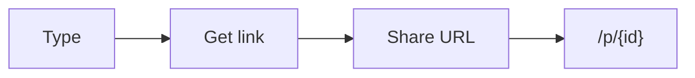
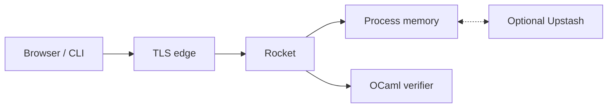

<div align="center">

# copypaste.fyi

**Type. Get link. Share.**

A pastebin that stays out of the way — on a phone, in a terminal, or on your own box.

[copypaste.fyi](https://www.copypaste.fyi) · [API](#api) · [Self-host](#self-host) · [Security](#security)

[](https://github.com/qxlsz/copypaste.fyi/actions/workflows/ci.yml)
[](#test)
[](https://crates.io/crates/copypaste)
[](LICENSE)

</div>

```text
$ copypaste send "notes from the incident"
https://www.copypaste.fyi/p/AbCdEf12GhJkLmNpQrStUvWx
```

On the site: type into the editor, tap **Get link**. The URL is on the clipboard. There is no account, no public listing, no “submit” hunt.


```mermaid
flowchart LR
  A[Type] --> B[Get link]
  B --> C[Share URL]
  C --> D["/p/{id}"]
```

## Use it

| | |
|---|---|
| **Web** | [copypaste.fyi](https://www.copypaste.fyi) — phones keep **Get link** in the thumb zone, above the keyboard |
| **CLI** | `cargo install copypaste` then `copypaste send "text"` |
| **curl** | `POST /api/pastes` with `{"content":"hello","format":"plain_text"}` |

Public writes are open. Pastes on the public instance live in that machine’s memory (one Fly VM, always on). Self-host if you need a lock, Redis, or your own retention.

## Self-host

```bash
docker compose up --build
# open http://127.0.0.1:8000
```

Compose is anonymous and in-memory. Use it on a private host. For a closed company instance:

```bash
COPYPASTE_REQUIRE_WRITE_AUTH=true
COPYPASTE_AUTH_TOKEN=<43–128 base64url chars>
```

Clients then send:

```http
X-CopyPaste-Write-Token: <credential>
```

From source (Rust **1.88+**, Node **22**):

```bash
./scripts/install_deps.sh
ROCKET_ADDRESS=127.0.0.1 ./scripts/run_both.sh   # API :8000, Vite :5173
```

```bash
cargo install copypaste
ROCKET_ADDRESS=127.0.0.1 copypaste serve
```

```bash
brew install qxlsz/tap/copypaste
```

## What it does

- 24-character IDs, 1 MiB cap, format + expiry + burn-after-reading
- Optional **server-side** AES-256-GCM / ChaCha20-Poly1305 (OCaml verifier on a private VM)
- JSON API, `/p/{id}` share pages, `/raw/{id}`, secret-file-aware CLI
- Optional Upstash Redis REST, Tor ingress, admin quarantine, content-safe anchoring

It does **not** do browser-only E2E encryption, public paste search, or exactly-once burn across multiple app instances.

## Architecture


```mermaid
flowchart LR
  browser[Browser / CLI]
  edge[TLS edge]
  app[Rocket]
  mem[Process memory]
  redis[Optional Upstash]
  ocaml[OCaml verifier]

  browser --> edge --> app
  app --> mem
  mem <-.-> redis
  app --> ocaml
```

Run **one** `app` instance. Sessions, stats, and burn consume are process-local. `COPYPASTE_FORCE_MEMORY=true` beats a leftover Redis secret (the public site uses this until Upstash is healthy).

## Security

Encryption happens in the Rust service. TLS to the edge is required; plaintext and the key can still exist in the app (and, for AES/ChaCha, in the OCaml verifier) while a paste is written. Keys are not stored on purpose. This is **not** zero-knowledge.

Burn-after-reading is best-effort. Link previews can consume a burn paste.

Read [SECURITY.md](SECURITY.md) and the [abuse runbook](docs/abuse-response.md) before putting an instance on the internet.

## API

| Method | Route | |
|---|---|---|
| `POST` | `/api/pastes` | Create. Public site: no token. Closed: write token. |
| `GET` | `/api/pastes/{id}` | JSON. Encrypted: `X-Paste-Key` |
| `GET` | `/p/{id}` | Share page |
| `GET` | `/raw/{id}` | Raw body |
| `GET` | `/api/stats/summary` | This-instance counts |
| `GET` | `/health`, `/api/health` | Liveness only — not Redis/verifier |

```bash
curl -sS -X POST https://www.copypaste.fyi/api/pastes \
  -H 'content-type: application/json' \
  -d '{"content":"hello from curl","format":"plain_text"}'
```

`401` missing key · `403` bad key · `404` missing/burned · `410` expired (while still cached) · `423` time-lock · `503` storage down.

## CLI

```bash
copypaste send "notes"
echo "log" | copypaste send --stdin --host https://www.copypaste.fyi
copypaste send --auth-token-file ./write-token "closed instance"
copypaste send --encryption-mode aes256_gcm --encryption-key-file ./paste-key "secret"
copypaste healthcheck --host http://127.0.0.1:8000
```

The CLI never takes a token or encryption key as a flag value. Remote hosts must be HTTPS. It prints the key-free share URL the server returned.

## Configure

| Variable | Public site | Purpose |
|---|---|---|
| `COPYPASTE_REQUIRE_WRITE_AUTH` | `false` | `true` locks `POST /api/pastes` |
| `COPYPASTE_AUTH_TOKEN` | unset | Write admission, 43–128 base64url in production |
| `COPYPASTE_FORCE_MEMORY` | `true` | Ignore Redis secrets; stay in RAM |
| `COPYPASTE_PERSISTENCE_BACKEND` | `memory` | `memory` or `redis` |
| `UPSTASH_REDIS_REST_URL` / `_TOKEN` | unset | Required when backend is `redis` |
| `COPYPASTE_MAX_PASTE_SIZE` | `1048576` | Cap, max 1 MiB |
| `COPYPASTE_ALLOWED_ORIGINS` | copypaste.fyi | Exact CORS list |
| `CRYPTO_VERIFIER_URL` | Fly private DNS | OCaml verifier |
| `COPYPASTE_REQUIRE_CRYPTO_VERIFICATION` | `true` | Fail create if verifier fails |

Full list and Tor/SQLite/admin notes: [CLAUDE.md](CLAUDE.md). Bundles, webhooks, attestations, and steganography stay off — turning their old flags on refuses to start.

## Deploy

Frontend: Vercel (`frontend/`, `vercel.json`). Backend: Fly (`fly.toml`, `Dockerfile.backend`). Image: `ghcr.io/qxlsz/copypaste.fyi`.

```bash
fly deploy
fly logs
```

Keep `app` at one machine. The verifier is a separate process group with no public port.

## Test

Same jobs as [CI](https://github.com/qxlsz/copypaste.fyi/actions/workflows/ci.yml):

```bash
python3 scripts/lint-workflows.py
cargo fmt --all -- --check
cargo clippy --all-targets --all-features -- -D warnings
cargo nextest run --workspace --all-features
cargo llvm-cov nextest --workspace --all-features --fail-under-lines 75
cd frontend && npm ci && npm test -- --run && npm run lint && npm run build
```

Shortcut: `./scripts/precommit.sh`. Agents: [AGENTS.md](AGENTS.md). Humans: [CONTRIBUTING.md](CONTRIBUTING.md).

## Layout

```text
src/bin/copypaste.rs     serve / send / healthcheck / config
src/server/              Rocket, crypto, Redis, guards
frontend/                React 19 + Vite composer
ocaml-crypto-verifier/   Independent AES/ChaCha checks
.github/workflows/       CI, Fly, GHCR, OCaml, release
```

## License

[Apache-2.0](LICENSE).
