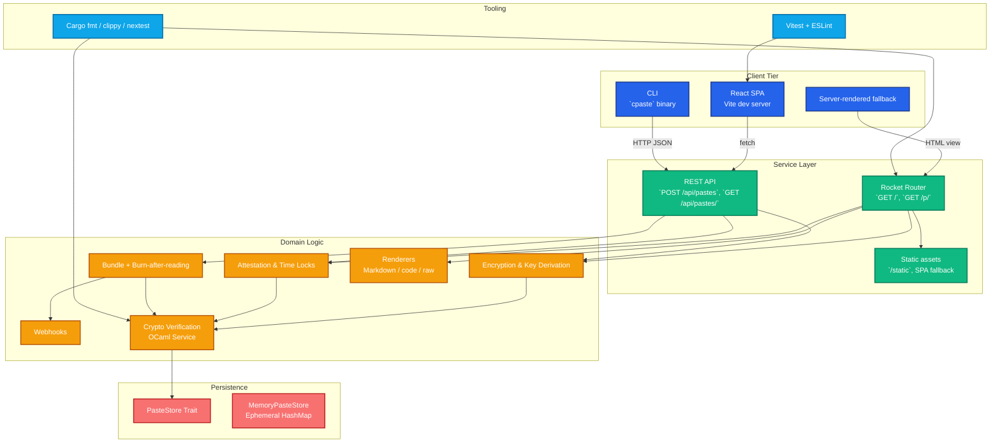

<div align="center">

# copypaste.fyi

Simple, open-source paste sharing for teams and individuals.

[](#run-with-docker-compose)
[](#run-locally)

</div>

## Overview

copypaste.fyi is a lightweight web service for creating and sharing plaintext snippets. It focuses on fast paste creation, predictable URLs, and minimal operational overhead. The UI is intentionally simple and responsive, making it easy to share links from any device.

Key traits:

- 🧠 **Zero complexity** – in-memory storage with minimal dependencies.
- ⚡ **Fast** – Rocket-based async backend with Tokio.
- 🐳 **Container friendly** – ready-to-run Docker image and compose service.
- 🔗 **Scriptable** – companion CLI (`cpaste`) for shell automation.
- 🧨 **One-time links** – optional burn-after-reading destroys pastes after the first successful view.
- 🔐 **Post-quantum ready** – Kyber hybrid encryption for future-proof security.

## Architecture



The SPA communicates with the Rocket REST API for creation and viewing, while the server still renders HTML for raw links and one-time fallbacks. Domain helpers handle encryption, attestations, bundles, and webhook notifications before persisting to the in-memory store.

- **Backend:** Rust (edition 2021), Rocket 0.5, Tokio 1.x
- **Cryptographic Verification:** OCaml service with `mirage-crypto` for independent security validation
- **Frontend:** React 19 + Vite 7, TanStack Query, Tailwind CSS
- **Storage:** Ephemeral in-memory `PasteStore`
- **CLI:** `cpaste` using `reqwest`
- **Tooling:** Cargo fmt/clippy/nextest, Vitest, ESLint

## Roadmap

### ✅ Post-quantum cryptography (Implemented)
Kyber hybrid encryption with AES-256-GCM is now available for quantum-resistant key exchange alongside classical algorithms.

### Zero-knowledge proof integration
Enable verifiable claims about encrypted paste properties (length, format, content type) without requiring decryption.

### Homomorphic search capabilities
Allow searching within encrypted pastes and applying transformations to ciphertext for advanced data processing workflows.

### Threshold access control
Multi-signature schemes for sensitive pastes requiring approval from multiple authorized parties.

### Federated deployments
Peer discovery and replication protocol so sovereign operators can exchange encrypted pastes with policy attestation.

### HSM-backed custodianship
Optional PKCS#11 and AWS CloudHSM adapters for environments that require hardware-rooted signing and key custody.

### Formal verification
Model authentication and policy flows in TLA+ and ProVerif to mechanically prove forward secrecy and non-repudiation.

## Getting Started

### Prerequisites

- Rust toolchain (1.82+) installed via [rustup](https://rustup.rs/) – for local builds
- Docker (24+) and Docker Compose v2 – for containerized setup

### Repository setup

Clone the repository, then install the tooling and git hooks used by CI:

```bash
# Install rustup toolchain, fmt/clippy, cargo-nextest, cargo-llvm-cov
./scripts/install_deps.sh

# Install the pre-commit hook (runs fmt, clippy, nextest on every commit)
./scripts/setup_git_hooks.sh
```

If the hook rewrites files (via `cargo fmt`) or a check fails, the commit is aborted so you can address the issue and re-stage. You can always run the steps manually with `cargo fmt --all`, `cargo clippy --all-targets --all-features -- -D warnings`, and `cargo nextest run --workspace --all-features`.

### Run Locally

```bash
# Fetch dependencies and build
cargo build

# Start the web server
cargo run --bin copypaste

# Application available at http://127.0.0.1:8000/
```

Once running, open a browser to `http://127.0.0.1:8000/`, enter text, and hit **Create paste** to receive a link. The backend serves the pre-built SPA from `static/dist` when the Vite dev server is not running.

### Frontend development

```bash
cd frontend
npm install               # run once; scripts/precommit.sh handles this too
npm run dev               # Vite dev server at http://127.0.0.1:5173/

# Lint + unit tests (Vitest)
npm run lint
npm test -- --run

# Build production assets (writes to static/dist)
npm run build
```

For an all-in-one local environment (Rocket API + Vite dev server) run `./scripts/run_both.sh`. Stop everything with `./scripts/stop.sh`.

## REST API

Interact with copypaste.fyi programmatically through the JSON API. All endpoints live under `/api` and accept/return UTF-8 JSON.

### Create a paste

`POST /api/pastes`

```bash
curl -X POST http://127.0.0.1:8000/api/pastes \
  -H 'Content-Type: application/json' \
  -d '{
        "content": "Hello from the API",
        "format": "plain_text",
        "retention_minutes": 60,
        "burn_after_reading": false,
        "encryption": {
          "algorithm": "aes256_gcm",
          "key": "correct-horse-battery-staple"
        }
      }'
```

**Request body**

| Field | Type | Required | Description |
| --- | --- | --- | --- |
| `content` | `string` | ✅ | Paste body. |
| `format` | `string` | ❌ | One of `plain_text`, `markdown`, `code`, `json`, `go`, `cpp`, `kotlin`, `java`. Defaults to `plain_text`. |
| `retention_minutes` | `number` | ❌ | Minutes before automatic deletion. Omit for no expiry. |
| `burn_after_reading` | `boolean` | ❌ | Delete paste after first successful view. |
| `encryption.algorithm` | `string` | ❌ | `aes256_gcm`, `chacha20_poly1305`, `xchacha20_poly1305`, or `kyber_hybrid_aes256_gcm`. |
| `encryption.key` | `string` | ⚠️ | Required when `encryption.algorithm` is provided. Never stored server-side. |

**Response**

```jsonc
{
  "id": "AbCdEf12",
  "shareableUrl": "/p/AbCdEf12",
  "burnAfterReading": false
}
```

The `shareableUrl` is relative to the server origin. For encrypted pastes, append `?key=<secret>` to the share link before sharing.

### Fetch a paste

`GET /api/pastes/{id}`

```bash
curl http://127.0.0.1:8000/api/pastes/AbCdEf12

# Encrypted paste
curl "http://127.0.0.1:8000/api/pastes/AbCdEf12?key=correct-horse-battery-staple"
```

**Response**

```jsonc
{
  "id": "AbCdEf12",
  "content": "Hello from the API",
  "format": "plain_text",
  "createdAt": 1730518840,
  "expiresAt": null,
  "burnAfterReading": false,
  "encryption": {
    "requiresKey": true,
    "algorithm": "aes256_gcm"
  },
  "timeLock": null,
  "persistence": {
    "kind": "memory"
  }
}
```

A `401 Unauthorized` response indicates a missing or invalid key for an encrypted paste. A `404` means the paste never existed or was already burned/time-locked.

### Raw paste view

`GET /p/{id}/raw`

Returns plain text (no JSON envelope) for shell-friendly consumption.

```bash
curl http://127.0.0.1:8000/p/AbCdEf12/raw
```

Encrypted pastes require the key query parameter: `/p/{id}/raw?key=<secret>`.

> 💡 Looking for CLI automation? See [CLI Usage (`cpaste`)](#cli-usage-cpaste) for examples that wrap these endpoints.

### Formatting options

- Plain text / Markdown / generic code block
- Language-specific code blocks: Go, C++, Kotlin, Java
- JSON pretty-print (parses and auto-indents or shows raw fallback)

**Encryption options**

- `None` – store plaintext (default)
- `AES-256-GCM` – deterministic 12-byte nonce per paste, client-supplied passphrase
- `ChaCha20-Poly1305` – compact 96-bit nonce cipher for performance-oriented clients
- `XChaCha20-Poly1305` – 24-byte nonce variant suited for longer keys and high-entropy secrets
- `Kyber Hybrid AES-256-GCM` – post-quantum key exchange with classical symmetric encryption

**Security Features**

- **Dual Cryptographic Verification**: Each encryption operation is independently verified by both the primary Rust implementation and a secondary OCaml service using `mirage-crypto` library for defense-in-depth security assurance.
- **Client-Side Encryption**: Keys are never stored server-side and encryption happens in memory before transmission.
- **Zero-Trust Architecture**: Encrypted pastes require explicit key sharing out-of-band.
- **Post-Quantum Ready**: Kyber hybrid encryption provides quantum-resistant key exchange with AES-256-GCM symmetric encryption.

### Kyber Hybrid Encryption

copypaste.fyi implements **Kyber hybrid encryption** - a post-quantum key encapsulation mechanism (KEM) combined with classical symmetric encryption for optimal security and performance.

**How it works:**
1. **PQ Key Generation**: Creates Kyber public/private key pair (simulated in current implementation)
2. **Key Encapsulation**: Derives shared secret from private key + nonce entropy
3. **Symmetric Encryption**: Uses SHA256(shared_secret + user_key) to derive AES-256-GCM key
4. **Storage Format**: Combines PQ components with encrypted payload: `PQ_ciphertext|PQ_public_key|aes_ciphertext|aes_nonce|PQ_private_key`

**Benefits:**
- **Quantum Resistance**: Kyber KEM protects against quantum attacks on key exchange
- **Performance**: AES-256-GCM provides fast symmetric encryption for large data
- **Future-Proof**: Easy migration path to real Kyber implementation
- **Compatibility**: Works alongside existing AES/ChaCha algorithms

**Current Status**: Hybrid simulation using SHA256 for KEM operations. Ready for production use with fallback to real Kyber implementation.

The web UI includes multiple passphrase helpers (**Geek**, **Emoji combo**, **Diceware blend**) and a live key-strength meter. Keys stay visible (or toggle to hidden) so you can share them out-of-band—the server never stores them. A share panel provides easy copy, email, Slack, X/Twitter, QR, and native share shortcuts.

**Extras**

- Burn after reading: toggle in the composer (or pass `--burn-after-reading` via CLI) to delete the paste after the first successful view.
- Raw view: append `/raw/<id>` (plus `?key=<passphrase>` when encrypted) to retrieve plaintext without HTML chrome.

➡️ Dive deeper in the [Encryption guide](docs/encryption.md) for algorithm notes, key derivation details, and operational advice.

### Run with Docker Compose

```bash
docker compose up --build

# Visit http://127.0.0.1:8000/
```

Compose mounts the `static/` directory for live UI updates. Data is stored in-memory inside the container; restart clears pastes.

### CLI Usage (`cpaste`)

Build the standalone CLI and point it at any copypaste.fyi instance.

```bash
# Build the binary
cargo build --bin cpaste --release

# Send text directly (defaults to http://127.0.0.1:8000)
./target/release/cpaste -- "Hello from CLI"

# Switch hosts as needed
./target/release/cpaste --host https://copypaste.fyi -- "notes"

# Stream from stdin
echo "log output" | ./target/release/cpaste --stdin --host http://localhost:8000 --
```

**Flags & arguments**

| Option | Description |
| ------ | ----------- |
| `--host <URL>` | Base URL of the copypaste server. Defaults to `http://127.0.0.1:8000`. |
| `--stdin` | Read the paste content from standard input instead of the command line argument. |
| `--format <plain_text|markdown|code|json|go|cpp|kotlin|java>` | Rendering mode for the paste. Defaults to `plain_text`. |
| `--encryption <none|aes256_gcm|chacha20_poly1305|xchacha20_poly1305|kyber_hybrid_aes256_gcm>` | Client-side encryption algorithm. When not `none`, pass `--key`. |
| `--key <string>` | Encryption key / passphrase (required for encrypted pastes). |
| `--burn-after-reading` | Delete the paste immediately after the first successful view (one-time link). |
| positional text | When `--stdin` is not provided, supply the text to paste as a positional argument. |

`cpaste --help` displays the full command reference.

### Packaging CLI for Releases

The repository includes a helper to bundle the CLI binary for GitHub releases.

```
# Build and package version 0.2.0 under dist/
./scripts/package_cli.sh 0.2.0

# Artifacts created:
# - dist/cpaste-0.2.0.tar.gz
# - dist/cpaste-0.2.0.tar.gz.sha256

# Suggested workflow:
# 1. git tag -a v0.2.0 -m "Release v0.2.0"
# 2. git push origin v0.2.0
# 3. Draft a GitHub release and upload the tarball + checksum
```

A GitHub Actions workflow (`.github/workflows/release.yml`) automates steps 2–4 whenever a tag matching `v*` is pushed: it runs the packaging script and publishes the generated artifacts as release assets.

## Project Structure

```
copypaste.fyi/
├── Cargo.toml          # Rust workspace and dependencies
├── Dockerfile.backend  # Multi-stage build for production (Rust + OCaml)
├── docker-compose.yml  # Local orchestration
├── fly.toml           # Fly.io deployment configuration
├── ocaml-crypto-verifier/    # OCaml cryptographic verification service
│   ├── dune-project
│   ├── lib/
│   │   └── crypto_verifier.ml
│   ├── bin/
│   │   └── server.ml
│   ├── test/
│   └── Dockerfile
├── src/
│   ├── lib.rs          # PasteStore trait + memory implementation
│   ├── main.rs         # Rocket application entry point
│   └── bin/
│       └── cpaste.rs   # CLI client
├── static/
│   └── index.html      # Frontend interface
└── .github/workflows/  # CI/CD pipelines
```

## Development Notes

- Pastes are kept in-process; production deployments should consider persistent storage.
- Use `cargo fmt` and `cargo clippy` before committing.
- The Docker image is built with Rust 1.82 slim base and serves the compiled binary on Debian bookworm.
- Async code steers clear of the futurelock pattern described in [RFD 609](https://rfd.shared.oxide.computer/rfd/0609); when adding concurrent flows, prefer spawning owned futures or a `JoinSet` instead of holding borrowed futures across `await` points.

## Contributing

Pull requests are welcome! Please:

1. Install the tooling and git hooks described in [Repository setup](#repository-setup).
2. Ensure formatting, linting, and tests pass locally: `cargo fmt --all`, `cargo clippy --all-targets --all-features -- -D warnings`, and `cargo nextest run --workspace --all-features`.
3. (Optional but encouraged) Verify coverage meets CI expectations: `cargo llvm-cov --workspace --all-features --nextest --fail-under-lines 75`.
4. Keep changes focused and add tests when extending functionality.

## About

Visit `/about.txt` for a plain text overview of the service and its security features.

## License

Licensed under the terms of the [MIT License](LICENSE).


